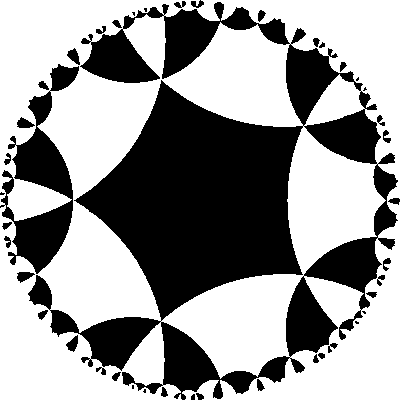
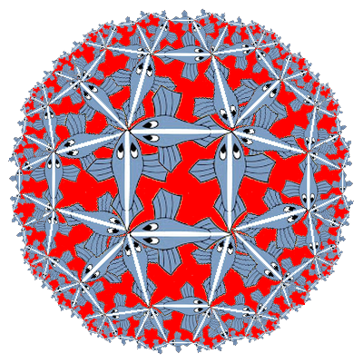

# Escher-Circle-Limit
Make hyperbolic tiling in the Poincare disk or image tiling in the Klein model

You will need: 
- Python 3.7+
- 'python -m pip install Pillow'

type
'python cli.py —help' to see all the possible arguments in command line

Example of the Poincare disk:

'python cli.py --poincare --layers 2 -o tesselation.png -p 5 -q 6 --size 400'

Example of the image tiling:

'python cli.py --color #ff0000 --layers 2 -o tesselation2.png -p 5 -q 6 -e fish2.png --size 400'

